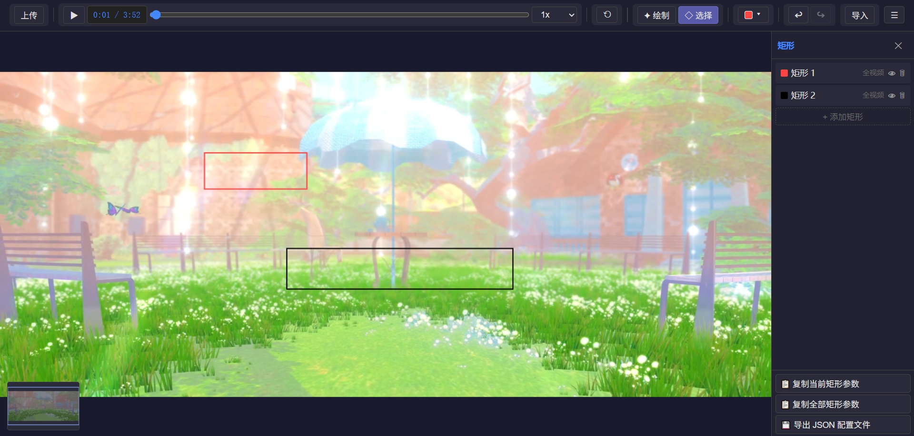

# FFmask Picker

> 浏览器内的可视化 FFmpeg `drawbox` 滤镜参数编辑器。上传视频，在画面上绘制矩形遮罩，配置属性后一键导出可直接使用的 FFmpeg 命令或矩形参数 JSON。



## 功能特性

- **可视化绘制** — 在视频帧上拖拽绘制矩形，支持绘制 / 选择两种模式
- **矩形编辑** — 点击选择、拖拽移动、八向调整大小、键盘删除
- **属性面板** — 位置 (X/Y)、尺寸 (宽/高)、颜色、透明度、线宽、填充、时间范围
- **颜色系统** — 9 种预设色 + 自定义颜色拾取器
- **播放与导航** — 播放/暂停、时间滑块、0.25x ~ 2x 倍速
- **视图控制** — 鼠标滚轮缩放、拖拽平移、画布复位、小地图导航、绘制/移动时实时显示 x/y/w/h
- **撤销/重做** — 最多 50 步历史栈
- **导出** — 当前矩形参数、全部矩形参数（剪贴板）、矩形 JSON 文件，以及完整的 FFmpeg 命令
- **导入** — 从之前导出的矩形 JSON 恢复编辑现场

## 在线 Demo

由 GitHub Pages 提供单文件部署：见仓库 Pages 页面。
你也可以在本地构建后直接用浏览器打开 `dist/ffmask-picker.html`——所有 JS/CSS/资源均已内联，无需服务器。

## 本地开发

```bash
pnpm install
pnpm dev        # 启动 Vite 开发服务器
pnpm typecheck  # 类型检查
pnpm build      # 构建单文件产物到 dist/ffmask-picker.html
```

## 使用流程

1. 打开应用，拖拽或点击上传视频（支持浏览器原生播放格式：mp4、webm、ogg 等）
2. 左上角切换至 **绘制** 模式，在画面上拖拽创建矩形
3. 切换至 **选择** 模式，点选矩形进行移动、调整大小或在右侧面板编辑属性
4. 调整颜色、透明度、线宽、填充与（可选）时间范围
5. 点击右侧导出按钮：复制单条/全部 `drawbox` 参数，或下载矩形 JSON 文件

### 键盘快捷键

| 快捷键 | 功能 |
|---|---|
| `Space` | 播放 / 暂停 |
| `Delete` / `Backspace` | 删除选中矩形 |
| `Ctrl/Cmd + Z` | 撤销 |
| `Ctrl/Cmd + Shift + Z` 或 `Ctrl + Y` | 重做 |

## 导出格式示例

**单条 drawbox 滤镜字符串**（可直接填入 `-vf`）：

```
drawbox=x=767:y=447:w=416:h=152:color=red@0.8:t=4:enable='between(t,1.500,5.000)'
```

**矩形参数 JSON 文件** (`ffmask-export.json`)：

```json
[
  {
    "x": 767, "y": 447, "width": 416, "height": 152,
    "color": "red", "thickness": 4, "filled": true,
    "opacity": 1, "visible": true,
    "timeRange": { "start": 1.5, "end": 5.0 }
  }
]
```

> 注：`timeRange` 的 `start`/`end` 单位为秒。`ffmask-export.json` 是用户绘制矩形的运行时导出产物，**不是应用配置文件**，已默认加入 `.gitignore`。

## 技术栈

Vanilla TypeScript + Vite 8 + `vite-plugin-singlefile`，构建为单个自包含 HTML 文件。无前端框架、无运行时依赖。TypeScript 严格模式为主要质量检查手段。

## 许可证

[MIT](LICENSE)